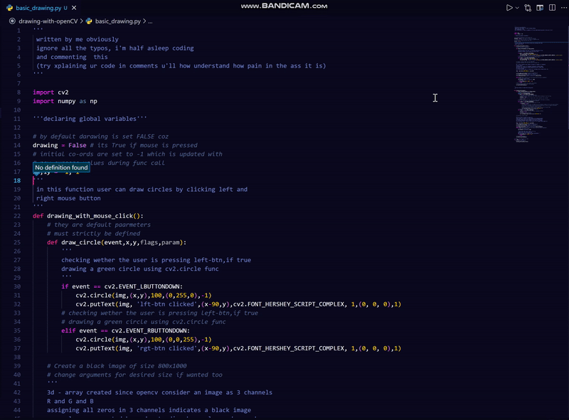
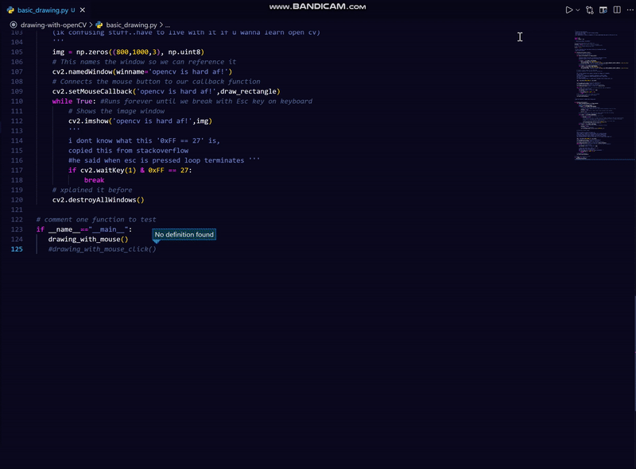

<h1 align="center">Drawing/painting idk -with-openCV</h1>
this repo basically contains all the learning from openCV, and maybe  few fun tricks in openCV. Primarly i add my progress and secondarly i'll add any cool scripts i've written that are worth sharing
# Did know u can draw with open cv??
- ### Here is how: 
# Drawing with mouse btn

- explained in detail in comments for evry line in source code, check that out.

# Drawing with mouse dragging

- explained in detail in comments for evry line in source code, check that out.

- # U ask me what's the use of this, NOTHING...absolutely NOTHING   then y did i do this? idk fr....i'm bored af.
